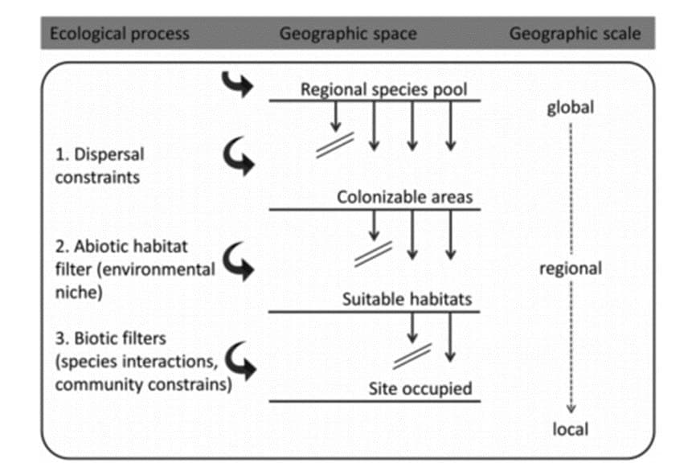
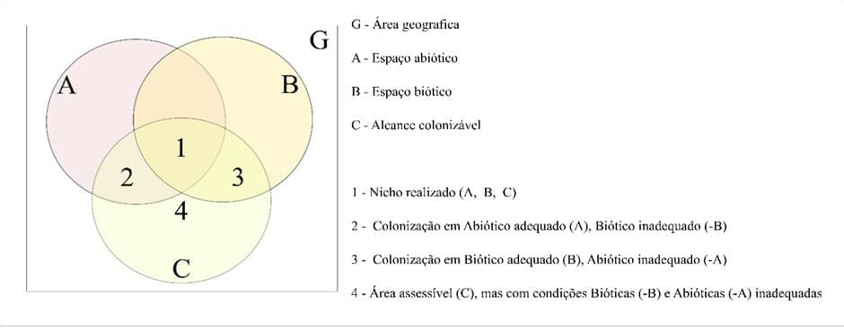

# Capítulo 3

-   10/08/2020 - 23/08/2020: leyendo
-   24/08/2020 - 31/08/2020: discusión

## Preguntas

1\. Mencione três fatores que influenciam a ocorrência de especies num determinado local e a escala na qual cada um desses fatores determina dita ocorrência.

2\. A observação "in situ" não permite conhecer todas as relações e a importância relativa de cada um dos fatores que influenciam a ocorrência de espécies. No capítulo são sugeridas abordagens complementarias para isso. Por favor mencione cada uma delas.

3\. Na figura 3.2 é mostrado que as observações a campo podem levar a várias situações em relação ao nicho de uma espécie: por favor enuncie as cuatro situações brevemente.

4\. Qual é a definição de nicho ambiental fundamental e de nicho realizado?

5\. ¿Cual de los conceptos de nicho abordado en este capitulo es resultado de las interacciones descriptas en esta afirmación?: "...gradients tend to be limited by physiological tolerance toward the physiologically more stressful edge, and by competitive interactions (i.e. exclusion) toward the physiologically less constraining and more productive parts of environmental gradients."

6\. ¿Sólo las interacciones negativas afectan el nicho realizado?

7\. De acuerdo a las lecturas previas tanto de este libro como de la bibliografía relacionada con la temática, cual de estas posturas considera que es más sólida para explicar el concepto de nicho:

(i) determined by the environmental requirements of species, i.e. consistent with Hutchinson's definition of the environmental niche

(ii) determined by the functional role a species plays within a food chain and the impact it has on its environment (mainly the resources it consumes), i.e. consistent with Elton's (1927) definition of the niche.

## FB

Acerca del capítulo III, me gustó mucho como está estructurado y fue un buen repaso de las fortalezas y debilidades teóricas del HSM (MDS). El título en si es atractivo, *¿What drives species distributions?* una pregunta genial, y parece que la respuesta está integrada por 3 condiciones que interactúan a una suerte de principio de incertidumbre que determinan donde puede habitar una especie y donde no.

a) acceso o movilidad de la sp: entiendo que hace alusión al área que puede dispersarse o invadir una especie. Definir el área de acceso nos obliga a conocer la historia biogeográfica de la especie que estemos modelando, pero saber dónde se originó nuestra especie nos conduce al campo de la Filogeografia.

b) hábitat idóneo, integrado por factores abióticos que no pueden ser modificados por las especies (esto parece ser solido en vertebrados terrestres) con tolerancias térmicas o eco fisiológicas definidas como aves endémicas o restringidas a determinados hábitat.

c) interacciones bióticas de las sp.: este punto podría englobarse en poblaciones sometidas a selección natural como para hacerlo más engorroso jaja ¿es necesario para determinar el nicho ambiental o las distribuciones de las especies?

## MDS

1 - **Mencione três fatores que influenciam a ocorrência de especies num determinado local e a escala na qual cada um desses fatores determina dita ocorrência:**

a\. Dispersión: a escala biogeográfica/global, se relaciona con la historia de la especie en cuestión

b\. Condiciones ambientales abióticas: a escala regional, se relaciona con las condiciones físicoquímicas del área

c\. Condiciones ambientales bióticas: a escala local, depende de las relaciones interespecíficas que se generan

2 - **A observação "in situ" não permite conhecer todas as relações e a importância relativa de cada um dos fatores que influenciam a ocorrência de espécies. No capítulo são sugeridas abordagens complementarias para isso. Por favor mencione cada uma delas.**

a\. Mediciones ecofisiológicas in situ

b\. Experimentos in situ o en comunidades artificiales

c\. Experimentos en el laboratorio

3 - **Na figura 3.2 é mostrado que as observações a campo podem levar a várias situações em relação ao nicho de uma espécie: por favor enuncie as cuatro situações brevemente.**

a\. Nicho realizado (la especie accede biogeográficamente, condiciones abióticas y condiciones bióticas aptas).

b\. Ambiente abiótico adecuado con condiciones bióticas inadecuadas (ej. Mucha competencia)

c\. Colonización fuera de las condiciones abióticas correctas, tal vez por facilitación.

d\. Presencia en condiciones bióticas y abióticas inadecuadas, tal vez debido a efectos históricos.

4 - **Qual é a definição de nicho ambiental fundamental e de nicho realizado?**

Nicho ambiental fundamental: Volumen multidimencional de condiciones ambientales dentro de la cual una especie puede mantener una población viable en ausencia de interacciones interespecíficas/bióticas.

Nicho realizado: subconjunto del nicho fundamental restringido por interacciones con una o varias otras especies.

5 - **¿Cual de los conceptos de nicho abordado en este capitulo es resultado de las interacciones descriptas en esta afirmación?: "...gradients tend to be limited by physiological tolerance toward the physiologically more stressful edge, and by competitive interactions (i.e. exclusion) toward the physiologically less constraining and more productive parts of environmental gradients.**"

El nicho realizado ya que representa al nicho fundamental restringido/condicionado por las interacciones bióticas.

6 - **¿Sólo las interacciones negativas afectan el nicho realizado?**

No, ya que otras interacciones (como simbiosis, mutualismo) también lo definen.

7 - **De acuerdo a las lecturas previas tanto de este libro como de la bibliografía relacionada con la temática, cual de estas posturas considera que es más sólida para explicar el concepto de nicho:**

**(i) determined by the environmental requirements of species, i.e. consistent with Hutchinson's definition of the environmental niche**

**(ii) determined by the functional role a species plays within a food chain and the impact it has on its environment (mainly the resources it consumes), i.e. consistent with Elton's (1927) definition of the niche.**

La (i)-environmental niche (que es la perspectiva que eligen los autores) incluye implícitamente al "nicho trófico" dentro del nicho realizado junto con el resto de las interacciones bióticas. Al ser más amplio, creo que la postura (i) es la más sólida.

## MMF

1 - **Mencione três fatores que influenciam a ocorrência de especies num determinado local e a escala na qual cada um desses fatores determina dita ocorrência:**

2 - **A observação "in situ" não permite conhecer todas as relações e a importância relativa de cada um dos fatores que influenciam a ocorrência de espécies. No capítulo são sugeridas abordagens complementarias para isso. Por favor mencione cada uma delas.**

R: Experimentos naturais (medições a campo) ou em laboratório.

3 - **Na figura 3.2 é mostrado que as observações a campo podem levar a várias situações em relação ao nicho de uma espécie: por favor enuncie as quatro situações brevemente.**

4 - **Qual é a definição de nicho ambiental fundamental e de nicho realizado?**

R: De maneira bem resumida, o nicho fundamental é todo o range de condições abióticas necessárias para que a espécie possa existir e se reproduzir ('ótimo' fisiológico), enquanto o realizado é a restrição do nicho fundamental pelas interações bióticas.

5 - **¿Cual de los conceptos de nicho abordado en este capitulo es resultado de las interacciones descriptas en esta afirmación?: "...gradients tend to be limited by physiological tolerance toward the physiologically more stressful edge, and by competitive interactions (i.e. exclusion) toward the physiologically less constraining and more productive parts of environmental gradients."**

R: Nicho abiótico (ou fundamental) e biótico (realizado).

6 - **¿Sólo las interacciones negativas afectan el nicho realizado?**

R: Um organismo também pode procurar outras espécies para ter interações positivas para definir seu nicho. Comensalismo e mutualismo com outras espécies na área podem facilitar a vida de um organismo.

7 - **De acuerdo con las lecturas previas tanto de este libro como de la bibliografía relacionada con la temática, cuál de estas posturas considera que es más sólida para explicar el concepto de nicho:**

**(i) determined by the environmental requirements of species, i.e. consistent with Hutchinson's definition of the environmental niche**

**(ii) determined by the functional role a species plays within a food chain and the impact it has on its environment (mainly the resources it consumes), i.e. consistent with Elton's (1927) definition of the niche.**

R: O nicho de uma espécie é tanto definido pelos requerimentos ambientais (nicho abiótico - colocado por Hutchinson) quanto pelo papel funcional da espécie em seu meio (nicho biótico -como colocado por Elton). Ambos determinam o sucesso de perpetuação de uma população em uma determinada região geográfica.
